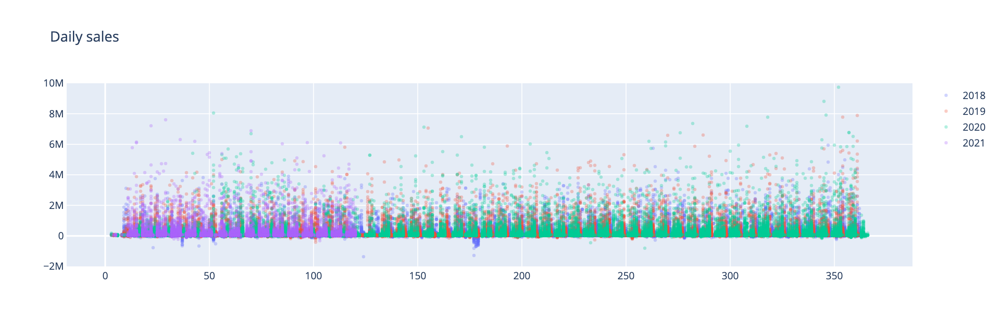

# Sales

##### Overview
This project is one of mine real-world ones and is based on a sales data of a B2B company. The primary goal was to predict monthly sales for the following year. The secondary one was to find similar companies and build a recommender system.
###### Dataset info
The initial dataset was in form of excel table and contained **308243** records of individual sales on a daily basis for years from 2018 to 2021 (Q1)
Each record had information on: date, product, quantity, cost, company, company tax number
##### Exploratory Data Analysis
###### Daily sales
It can be noticed that there are higher peak daily sales with time. My goal is to predict monthly sales. As a rule of thumb it's necessary to work with twice more frequent periods than considered for prediction. I'll try to consider the sales on weekly basis as it seems more logical and easier for perception.

###### Weekly sales
Visual check of weekly data shows that the data is stationary. Though it seems that there's a slightly visible trend.

Let's decompose this data into trend, seasonal and residual components.

Despite there's an increasing trend, Dickey-Fuller test showed that the process can be considered stationary (-5.463622, p-value=0.000002). That means tha we can proceed to data preparation and time series modeling. But before that let's take a brief look at monthly and yearly data and corresponding boxplots.
###### Time series decomposition
In this section the data was decomposed into:
* seasonal component
* trend component
* residual component

Boxplots were formed which allow to assess the significance of the differences month-to-month (seasonality) and year-to-year (trend)

It can be seen that though in 2020 the interquartile range is enormous (thanks to global pandemic) there's a slight positive trend.
Seasonality is pretty distinct which is a good sign for predictions.

#### Modelling
##### Regression
I chose regression based modeling as a first approach which allows to build comparatively simple and interpretable models (compared to neural networks).
What I decided to do is to go through several modeling techniques:

* Random forest regression
* Gradient boosting
* CatBoost
* XGBoost

But before that it's necessary to generate some features.
###### Feature generation
As soon as the data is 1-dimensional to build a more accurate model we need to generate more features.
One approach is to generate polynomial features, but as soon as we have time series data it makes more sense to generate features such as previous values (lags), rollong sum and rolling mean. Tim window for feature generation is 52 week.
###### Train and test sets
I split my data into train and test sets with proportions of 80% and 20% respectively though I thought about increasing test size up to 85% to gain maximum sequence information due to unusual data of year 2020, which was caused by Covid.
###### Preliminary results
I was not totally satisfied with metrics for regression models and decided to try a more complex approach - neural networks.

##### LSTM
If we consider time series, the natural choice is a long short-term memory neural networks which are basically a type of recurrent neural networks which allow to take into the account precedent data (or 'remember' it) so it's a great option for time series prediction tasks.
I performed a self-made grid search which iterated over following parameters:
* Number of hidden units: 5, 10, 15, 25, 50
* Number of stacked LSTM layers over the first one: 0,1,2

I used early stopping approach with maximum number of epochs equal to 1000 and patience parameter of 20. For each combination of parameters I fitted 5 models and on the plot on the right you can see mean RMSE values for those models.
#### Recommender system
As a part of this project a recommender system was developed using user-user (customer-customer) approach, which means that for each customer I created a sparse vector of products which contained values of number of purchased items. That vectors were used to identify similar customers by cosine similarity. As soon as there were not so many customers I simply calculated pairwise cosine similarity and found closest pairs with each customer.
Then I found products which were purchased by similar customers and were not purchased by the considered customer. This products formed a recommendation list for a particular customer which then was used by sales team.

#### Final results and thoughts
##### Final results
What do we have in the end? We have a bunch of models which are not outstanding from RMSE point of view. But what we can do is to imitate a voting regressor, i.e. having numerous (not in my case but still) models, take an average of their predictions.

What can be done to improve the model? We can do several things:

* Increasing number of features by obtaining some external data which possibly affects the sales, e.g. volume of housing commissioned, GDP, etc.
* Stratify customers by clustering or by amount of purchased goods
* Obtain more data

Regarding Recommender system, the following question can be discussed with stakeholders: should we check if companies are similar in terms of total sales or half a year or last month, etc?
From statistical point of view we could approach this question by defining the mean period which leads to significant difference in companies purchases. Say we set a threshold of 20%:

1. We get a company's product set for the 3rd/6th month (to avoid possible significant differences during the initial period when product range is unstable)
2. Then with a time step of 1 month we check if If the company's top-N product range differs by 20%
3. Then we can define the mean period for all companies
